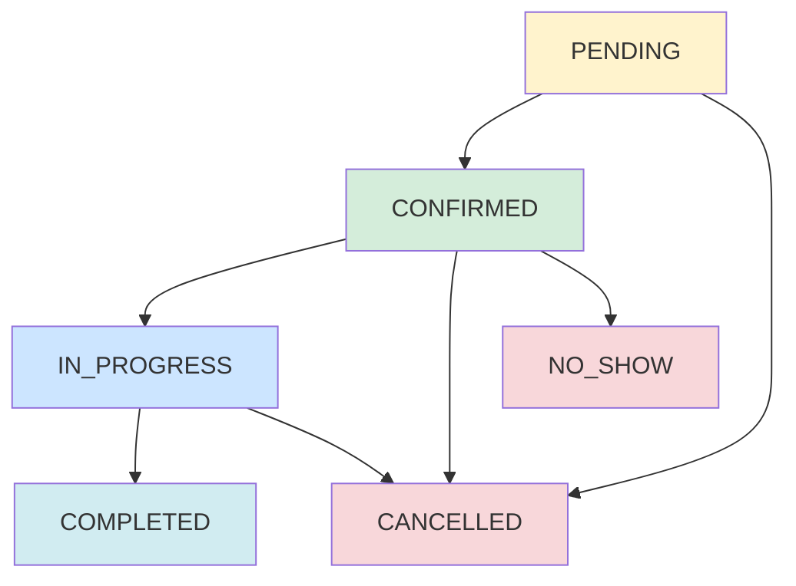

# 📚 Session Booking API Documentation

## 🚀 **Overview**

The Session Booking API provides comprehensive endpoints for managing mentorship sessions from booking to completion. All endpoints are secured and require appropriate authentication.

**Base URL**: `http://localhost:8080/api/v1/sessions`

## 🔐 **Authentication**

All endpoints require JWT authentication. Include the token in the Authorization header:
```
Authorization: Bearer <your-jwt-token>
```

## 📋 **API Endpoints**

### 1. **Book a Session** 📅
Create a new mentorship session booking request. All sessions are automatically set to 1 hour duration.

**Endpoint**: `POST /api/v1/sessions/book`  
**Access**: Any authenticated user  
**Status**: Creates session in `PENDING` status  
**Duration**: Automatically set to 1 hour from `scheduledStart`  

**Request Body**:
```json
{
  "mentorId": "uuid-of-mentor",
  "menteeId": "uuid-of-mentee", 
  "skillId": "uuid-of-skill",
  "scheduledStart": "2024-01-15T10:00:00Z",
  "scheduledEnd": "2024-01-15T11:30:00Z",
  "meetingPlatform": "GOOGLE_MEET",
  "menteeMessage": "Looking forward to learning React hooks!"
}
```
*Note: Sessions can be 30 minutes to 4 hours in duration. Currency is set to KES (Kenyan Shilling).*
```

**Response** (201 Created):
```json
{
  "status": "success",
  "message": "Session booking created successfully",
  "data": {
  "id": "session-uuid",
  "mentorId": "mentor-uuid",
  "menteeId": "mentee-uuid",
  "skillId": "skill-uuid",
  "title": "Mentorship Session: React Development",
  "description": "Session requested by mentee",
  "scheduledStart": "2024-01-15T10:00:00Z",
  "scheduledEnd": "2024-01-15T11:00:00Z",
  "status": "PENDING",
  "meetingPlatform": "GOOGLE_MEET",
  "meetingUrl": null,
  "meetingId": null,
  "price": 50.00,
  "currency": "KES",
  "paymentStatus": "PENDING",
  "menteeMessage": "Looking forward to learning React hooks!",
  "mentorResponse": null,
  "confirmedAt": null,
  "cancelledAt": null,
  "createdAt": "2024-01-15T09:30:00Z",
  "updatedAt": "2024-01-15T09:30:00Z"
  },
  "timestamp": "2024-01-15T09:30:00"
}
```

### 2. **Confirm Session** ✅
Mentor confirms a pending session booking.

**Endpoint**: `POST /api/v1/sessions/{sessionId}/confirm`  
**Access**: Mentor role required  
**Status**: Updates session to `CONFIRMED`, creates meeting link  

**Request Body**:
```json
{
  "mentorResponse": "Great! I'll help you master React hooks. See you then!"
}
```

**Response** (200 OK):
```json
{
  "id": "session-uuid",
  "status": "CONFIRMED",
  "meetingUrl": "https://meet.google.com/abc-defg-hij",
  "meetingId": "meet-12345678",
  "mentorResponse": "Great! I'll help you master React hooks. See you then!",
  "confirmedAt": "2024-01-15T09:45:00Z",
  "calendarEventId": "cal_event_12345678",
  ...
}
```

### 3. **Cancel Session** ❌
Cancel a session booking.

**Endpoint**: `POST /api/v1/sessions/{sessionId}/cancel`  
**Access**: Mentor, Mentee, or Admin  

**Request Body**:
```json
{
  "cancelledBy": "MENTEE",
  "reason": "Schedule conflict - need to reschedule"
}
```

**Response** (200 OK):
```json
{
  "id": "session-uuid",
  "status": "CANCELLED",
  "cancelledAt": "2024-01-15T09:50:00Z",
  "cancellationReason": "Schedule conflict - need to reschedule",
  "cancelledBy": "MENTEE",
  ...
}
```

### 4. **Get Session Details** 📖
Retrieve detailed information about a specific session.

**Endpoint**: `GET /api/v1/sessions/{sessionId}`  
**Access**: Any authenticated user  

**Response** (200 OK):
```json
{
  "id": "session-uuid",
  "title": "Mentorship Session: React Development",
  "description": "Session requested by mentee",
  "status": "CONFIRMED",
  "meetingPlatform": "GOOGLE_MEET",
  "meetingUrl": "https://meet.google.com/abc-defg-hij",
  "scheduledStart": "2024-01-15T10:00:00Z",
  "scheduledEnd": "2024-01-15T11:00:00Z",
  "price": 50.00,
  "currency": "KES",
  ...
}
```

### 5. **Get Mentor's Sessions** 👨‍🏫
Retrieve all sessions for a specific mentor with pagination.

**Endpoint**: `GET /api/v1/sessions/mentor/{mentorId}?page=0&size=20`  
**Access**: Mentor role + own sessions only  

**Response** (200 OK):
```json
{
  "content": [
    {
      "id": "session-1-uuid",
      "status": "CONFIRMED",
      "scheduledStart": "2024-01-15T10:00:00Z",
      ...
    },
    {
      "id": "session-2-uuid", 
      "status": "COMPLETED",
      "scheduledStart": "2024-01-14T14:00:00Z",
      ...
    }
  ],
  "pageable": {
    "pageNumber": 0,
    "pageSize": 20
  },
  "totalElements": 15,
  "totalPages": 1,
  "first": true,
  "last": true
}
```

### 6. **Get Mentee's Sessions** 👨‍🎓
Retrieve all sessions for a specific mentee with pagination.

**Endpoint**: `GET /api/v1/sessions/mentee/{menteeId}?page=0&size=20`  
**Access**: Mentee role + own sessions only  

**Response**: Same structure as mentor sessions

### 7. **Get Sessions by Skill** 🎯
Retrieve all sessions for a specific skill/topic.

**Endpoint**: `GET /api/v1/sessions/skill/{skillId}?page=0&size=20`  
**Access**: Any authenticated user  

**Response**: Paginated list of sessions for the skill

### 8. **Update Session Status** 🔄
Update session status (admin/system operation).

**Endpoint**: `PUT /api/v1/sessions/{sessionId}/status?status=IN_PROGRESS`  
**Access**: Admin role required  

**Response** (200 OK):
```json
{
  "id": "session-uuid",
  "status": "IN_PROGRESS",
  "updatedAt": "2024-01-15T10:05:00Z",
  ...
}
```

## 🔄 **Session Status Flow**



**Status Descriptions**:
- **PENDING**: Waiting for mentor confirmation
- **CONFIRMED**: Mentor confirmed, meeting scheduled
- **IN_PROGRESS**: Session is currently happening
- **COMPLETED**: Session finished successfully
- **CANCELLED**: Session was cancelled
- **NO_SHOW**: Mentee didn't show up

## 📝 **Request Examples**

### Book a Session (cURL)
```bash
curl -X POST "http://localhost:8080/api/v1/sessions/book" \
  -H "Authorization: Bearer your-jwt-token" \
  -H "Content-Type: application/json" \
  -d '{
    "mentorId": "123e4567-e89b-12d3-a456-426614174000",
    "menteeId": "123e4567-e89b-12d3-a456-426614174001", 
    "skillId": "123e4567-e89b-12d3-a456-426614174002",
    "scheduledStart": "2024-01-15T10:00:00Z",
    "meetingPlatform": "GOOGLE_MEET",
    "menteeMessage": "Excited to learn!"
  }'
```

### Confirm Session (cURL)
```bash
curl -X POST "http://localhost:8080/api/v1/sessions/{sessionId}/confirm" \
  -H "Authorization: Bearer mentor-jwt-token" \
  -H "Content-Type: application/json" \
  -d '{
    "mentorResponse": "Looking forward to our session!"
  }'
```

### Get Session Details (cURL)
```bash
curl -X GET "http://localhost:8080/api/v1/sessions/{sessionId}" \
  -H "Authorization: Bearer your-jwt-token"
```

## ⚠️ **Error Responses**

### 400 Bad Request
```json
{
  "timestamp": "2024-01-15T10:00:00Z",
  "status": 400,
  "error": "Bad Request",
  "message": "Invalid booking request",
  "path": "/api/v1/sessions/book"
}
```

### 404 Not Found
```json
{
  "timestamp": "2024-01-15T10:00:00Z",
  "status": 404,
  "error": "Not Found", 
  "message": "Session not found",
  "path": "/api/v1/sessions/12345"
}
```

### 409 Conflict
```json
{
  "timestamp": "2024-01-15T10:00:00Z",
  "status": 409,
  "error": "Conflict",
  "message": "Mentor not available at requested time",
  "path": "/api/v1/sessions/book"
}
```

## 🔍 **Validation Rules**

### Session Booking
- **mentorId**: Required, must exist
- **menteeId**: Required, must exist  
- **skillId**: Required, must exist
- **scheduledStart**: Required, must be in future
- **meetingPlatform**: Required, GOOGLE_MEET or ZOOM
- **menteeMessage**: Optional, max 1000 characters

### Time Validation
- Session must be scheduled at least 1 hour in advance
- Sessions are automatically set to 1 hour duration
- Sessions can only be scheduled between 6 AM and 10 PM
- Sessions cannot span across midnight
- Mentor must be available during requested time slot

### Status Transitions
- PENDING → CONFIRMED, CANCELLED
- CONFIRMED → IN_PROGRESS, CANCELLED, NO_SHOW  
- IN_PROGRESS → COMPLETED, CANCELLED
- COMPLETED/CANCELLED/NO_SHOW → No transitions (terminal states)

## 🎯 **Integration Features**

### Google Meet Integration ✅
- **Automatic Link Generation**: Creates unique Google Meet links
- **Meeting Codes**: Generates meet.google.com/abc-defg-hij format
- **No API Keys Required**: Works immediately without configuration

### Email Notifications 📧
- **Mentor Notification**: New booking request with mentee details
- **Mentee Confirmation**: Session confirmed with meeting link
- **Cancellation Alerts**: Both parties notified of cancellations
- **Reminders**: 24-hour advance reminders

### Calendar Integration 📅
- **Google Calendar**: Automatic event creation (when configured)
- **Meeting Links**: Embedded in calendar events
- **Timezone Support**: Handles different timezones properly

## 🧪 **Testing**

### Swagger UI
Visit: `http://localhost:8080/swagger-ui.html`

### Postman Collection
Import the OpenAPI spec from: `http://localhost:8080/v3/api-docs`

### Health Check
```bash
curl http://localhost:8080/actuator/health
```

---

**🎉 Your Session Booking API is ready for production use!** 

The API provides a complete booking workflow with Google Meet integration, email notifications, and comprehensive session management. All endpoints are secured, validated, and documented for easy integration.
